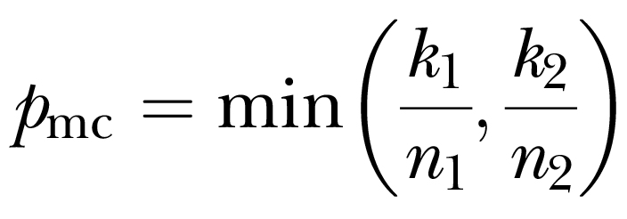

# mstree

This Perl program calculates the minimum clade proportion (*p<sub>mc</sub>*) and time to the most recent common ancestor (*TMRCA*) for coalescent genealogies generated with the coalescent simulator [*ms*](http://home.uchicago.edu/%7Erhudson1/source/mksamples.html).

The *p<sub>mc</sub>* summary statistic was developed and reported in:

Cox MP, FL Mendez, TM Karafet, M Metni Pilkington, SB Kingan, G Destro-Bisol, BI Strassmann and MF Hammer. 2008. [Testing for archaic hominin admixture on the X chromosome: Model likelihoods for the modern human *RRM2P4* region from summaries of genealogical topology under the structured coalescent](https://doi.org/10.1534/genetics.107.080432). *Genetics* 178: 427-437.

Specifically, the code implements equation A1 in the Appendix of Cox *et al* (2008) for the minimum clade proportion (*p<sub>mc</sub>*):



where *n<sub>1,2</sub>* and *k<sub>1,2</sub>* are, respectively, the total number of individuals and number of chromosome copies from a specified group in basal clades 1 and 2.

INSTALLATION

*mstree* requires a standard working Perl installation and has been confirmed to work with Perl versions up to 5.18.2.

USAGE

Assuming a standard installation (*i.e.,* with *mstree.pl* aliased to *mstree*), usage information can be found by running the command:

```
mstree
```

The program expects two values: –g1, the number of individuals in the selected group; and –g2, the number of individuals in the non-selected group.

```
mstree -g1 6 -g2 4
```


*mstree* reads coalescent genealogies from [Richard Hudson's](http://home.uchicago.edu/~rhudson1/) [*ms*](http://home.uchicago.edu/%7Erhudson1/source/mksamples.html).  Genealogies must be generated in *ms* using the –T flag, which outputs the coalescent tree in [Newick format](https://en.wikipedia.org/wiki/Newick_format).  Users should also generally apply the –I flag to define at least two populations.  *mstree* assumes that the first *n* individuals in the ms output belong to the selected group (–g1 *n*).  The user must define input datasets such that this condition holds true.

EXAMPLE

The following command line simulates 3 datasets, each containing 10 chromosome copies, with the first 6 copies deriving from group 1 and the remaining 4 copies from group 2:

```
ms 10 3 -t 5 -I 2 6 4 1 -T | mstree -g1 6 -g2 4
```

The coalescent genealogies generated by *ms* are of course random, but the output formatting looks like the following, with each line containing summaries for a single input dataset:

```
pmc    tmrca
0.33333    1.691
0.42857    0.903
0.00000    4.653
```
